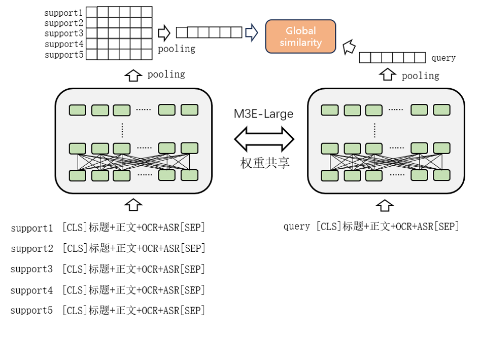
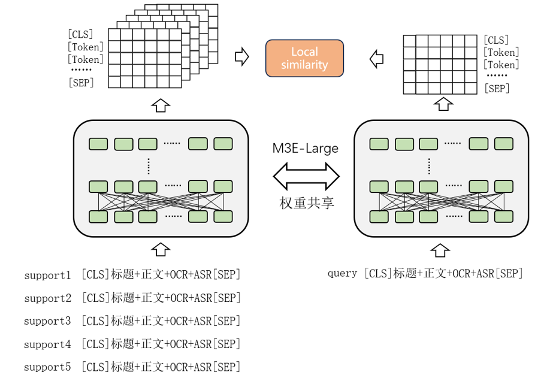

# 2024DCIC-FewShot-SocialTextClassification
2024DCIC 少样本条件下的社交平台话题识别 rank9

### 复现流程

#### （0）环境搭建

执行以下命令来安装项目所需的依赖：
```sh
cd code
pip install -r requirements.txt
```

#### （1）预训练模型

m3e-large，权重链接: [https://modelscope.cn/models/Jerry0/M3E-large/files](https://modelscope.cn/models/Jerry0/M3E-large/files)

#### （2）数据预处理

step1.过滤掉文本中诸如“【标题】”，“【正文】”，“【封面_OCR】”，“【抽帧_OCR】”，“【语音转写】”这类标签文本；

step2.过滤掉文本中的超链接，例如“http(s):...”

以上预处理在[retrieval_dataset.py](code%2Fretrieval_dataset.py)中处理，因此复现训练、推理以及B榜无需执行额外的预处理命令。

#### （3）训练阶段

以m3e-large为预训练权重，在训练集上进行多分类微调，同时加入对抗训练的方式来提升模型的泛化能力；

复现训练请执行以下命令：
```sh
sh train/run_pretrain.sh
```

其中 run_pretrain.sh 主要参数的含义如下：
```sh
python main_pretrain.py \
--data_path 训练数据路径 \
--batch_size 8 \
--task_name 'models' \
--encoder_dir 预训练权重路径 \
--max_len 512 \
--random_lr 1e-4 \
--pretrained_lr 1e-5 \
--schedule_type 'none' \
--use_fp16 \
--valid_ratio 按类别划分的验证集比例 \
--epochs 6 \
--preprocess \
--use_fgm \
--output_dir 模型保存路径 \
```


#### （4）推理阶段

本项目采样了两种不同粒度（全局相似度和局部相似度）的相似度计算方法。具体而言也就是我们会计算query和support之间的全局embedding的余弦相似度，以及计算有效token之间的相似度。同时由于该任务对阈值比较敏感，不同task阈值并不完全相同，因此根据每个task中support文本之间的相似度来计算阈值；

a. 全局相似度：
- 取有效token（除[PAD] token之外的）的mean embedding作为文本的全局embedding；
- 然后对当前task内所有support的全局embedding进行mean操作；
- 最后计算query和support mean的embedding之间的余弦相似度；

<center class ='img'>

</center>

b. 局部相似度：
- 计算query的每个有效token和support的全部有效token的余弦相似度，并取最大相似度作为query中每个token的相似度；
- 然后对query中所有有效token的相似度的均值作为当前query和support之间的相似度；
- 最后会循环计算每个query和当前task中所有support的相似度并取均值；

<center class ='img'>

</center>
最终将(全局相似度+局部相似度)/2作为最终的相似度。

c.动态阈值：
- 计算每个support之间的局部相似度，最后取均值作为当前task的阈值；
- 由于上述计算的阈值在验证集和训练集的部分类别上都出现了recall高于precision的情况，因此人工设置设置了eps=0.0375和上述阈值相加作为最终阈值，以此来适当调高阈值。

复现推理（以api请求的方式）执行以下命令来启动服务：
```sh
sh main.sh
```
然后通过request的POST方法来请求服务，url为http://0.0.0.0:8090/predict
